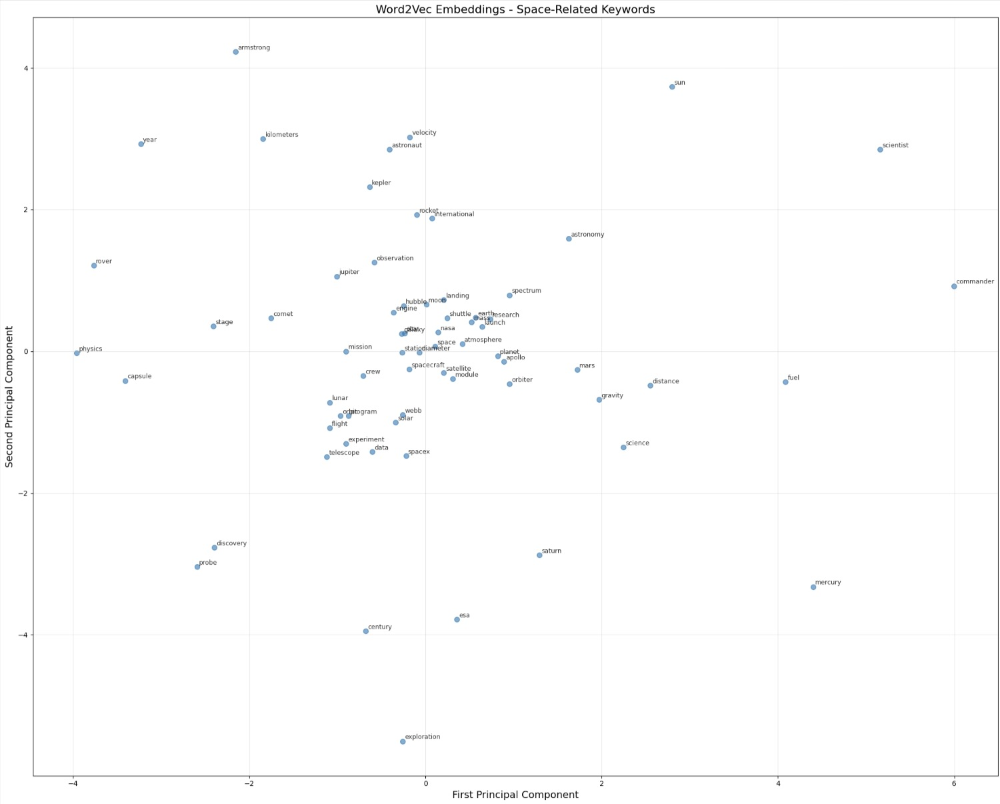

# Introduction

This project trains a Word2Vec neural network model on Wikipedia articles about space to learn semantic relationships between keywords and visualizes them in 2D using PCA. This is also the first time I seriously used Colab, although I didn't make good use of it because in the end I put everything into one cell anyway.
Also, although I didn't write literal cuda code, this is my first time using cuda's parallel processing through PyTorch.

## Overview

The model downloads over 20 Wikipedia articles about space, processes the text into training pairs using a skip-gram architecture with negative sampling, and trains 100-dimensional word embeddings on GPU. The learned vectors are then reduced to 2D and plotted to show which words appear in similar contexts.

## Throughout the coding process

Initially, I tried using a 2000-word AI-generated corpus about LLMs, but it was too short to derive meaningful relationships. The embeddings were essentially random.

By switching to Wikipedia articles (more than 100k words), the model successfully learned real relationships better than the previous attempt, which may not be saying much but I didn't want to burn through my computing limit for the month with one project. With a larger corpus, words that appear together frequently now have similar vectors, creating clear clusters in the visualization.

## Some relationships in the visualization

Some of these may be a stretch but you can see that quadrant III contains a lot of "operational" keywords like data, experiment, spacex, telescope, etc.
Near the origin in quadrant I, there's more NEO/Earth related terms like atmosphere, earth, research, scientist.

## Technical details

- Architecture: Skip-gram with negative sampling
- Embedding dimension: 100
- Window size: 3
- Training: 200 epochs with mini-batch SGD
- Visualization: PCA reduction to 2D
- Hardware: Google Colab GPU (CUDA)
